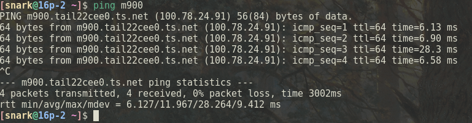
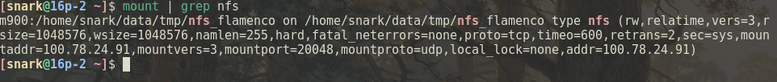
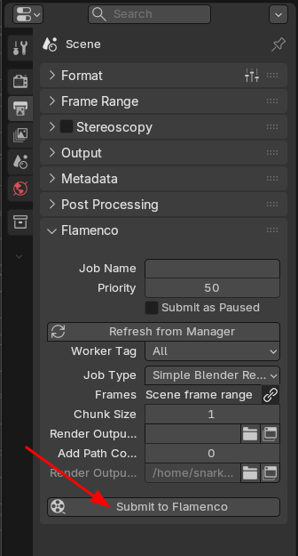
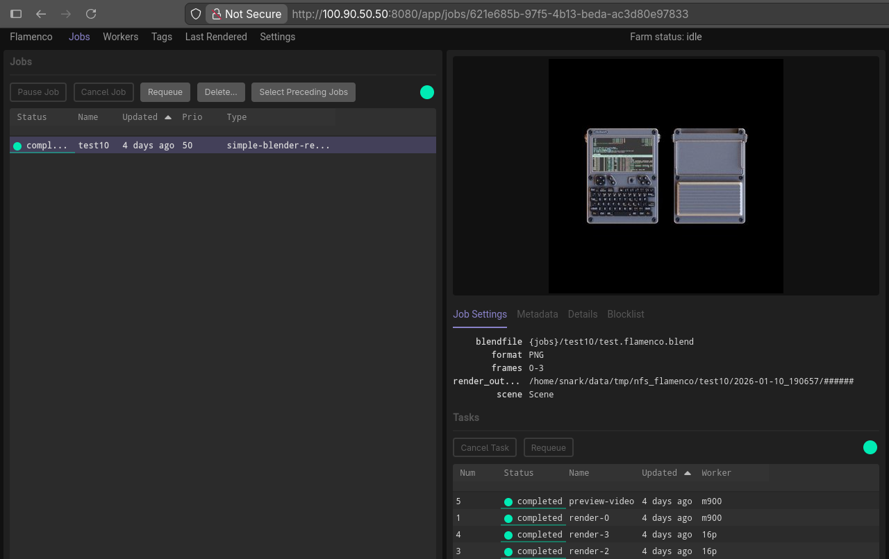

# Домашняя рендер-ферма для Blender


В этой статье я расскажу о настройке домашней рендер-фермы для 3D-редактора **Blender**. В основе нашей фермы будет **[Flamenco](https://flamenco.blender.org/)** — открытый кроссплатформенный фреймворк для мониторинга и управления рендер-задачами.

Фреймворк состоит из трёх компонентов:

- **Flamenco Add-on**
- **Flamenco Manager**
- **Flamenco Workers**

Аддон связывает Blender и Flamenco, Менеджер распределяет задачи между Воркерами и предоставляет веб-интерфейс для управления всем процессом. Именно Воркеры выполняют рендер. Flamenco может использоваться и на одном компьютере: скорость рендера это не увеличит, но добавит удобства.


На мой взгляд, Flamenco — явно недооценённый софт, который заслуживает большего внимания со стороны пользователей. Он быстро разворачивается, не требует сложной инфраструктуры и при этом предоставляет функциональность, сравнимую с коммерческими решениями. Для небольших студий и энтузиастов это отличный способ организовать распределённый рендер без лишних затрат и зависимости от сторонних сервисов.

Для полноценной рендер-фермы потребуется:

- 2 компьютера или больше;
- Blender;
- Flamenco;
- общая сетевая директория;
- Tailscale — опционально, если мы не хотим ограничиваться пределами локальной сети.

Для минимальной конфигурации достаточно одного ПК с установленными Blender и Flamenco. В этом случае один ПК будет и Менеджером, и Воркером.

Приступим к настройке. Я буду использовать операционную систему **Arch Linux, однако Flamenco также поддерживает Windows** и **macOS**.

---

## 1. Установка Tailscale


Для начала нам понадобится **Tailscale** — он позволит объединить все компьютеры фермы в одну виртуальную сеть и получить доступ к ферме из внешнего мира.

Tailscale не требует сложной настройки VPN, проброса портов или выделенного сервера. После установки все машины получат Tailscale-IP и будут видеть друг друга так, как будто находятся в одной локальной сети.

Устанавливаем Tailscale на все компьютеры фермы.
```bash
sudo pacman -S tailscale
sudo systemctl enable --now tailscaled 
sudo tailscale up
```
После выполнения команды `tailscale up` откроется браузер, где нужно авторизоваться через Google, GitHub или другим способом.

На безголовом сервере можно выполнить авторизацию через SSH, используя ключ из панели управления Tailscale:
```bash
tailscale up --authkey=tskey-KEY
```
В моей конфигурации:

- **16p** — будет выполнять роль Менеджера;
- **m900** — будет выполнять роль Воркера и NFS-сервера.


После этого проверяем, что компьютеры пингуются друг с другом по Tailscale-IP — эти адреса понадобятся нам дальше при настройке NFS и Flamenco.

```bash
ping m900
```



---

## 2. Установка NFS-шары


NFS-сервером может быть любой компьютер. В моём случае это Воркер **m900**.

Ставим `nfs-utils` и запускаем сервис:
```bash
sudo pacman -S nfs-utils
sudo systemctl enable --now nfs-server
```
Обычно этого достаточно, но у меня файловая система **ZFS**, поэтому дополнительно включаем `sharenfs` для датасета с будущей шарой и запускаем соответствующий сервис:
```bash
zfs set sharenfs=on zroot/data/tank
sudo systemctl enable --now zfs-share.service
```
Создаём директорию для шары:
```bash
mkdir -p ~/data/tmp/nfs_flamenco
```
Важно: путь к шаре должен быть **одинаковым на всех машинах**, иначе Blender и Flamenco не смогут корректно находить файлы.

Теперь возвращаемся на Менеджер (**16p**), устанавливаем NFS-клиент и монтируем шару:
```bash
sudo pacman -S nfs-utils 
mkdir -p ~/data/tmp/nfs_flamenco 
sudo mount -t nfs m900:$HOME/data/tmp/nfs_flamenco $HOME/data/tmp/nfs_flamenco
```
Проверяем, что шара успешно примонтирована:
```bash
mount | grep nfs
```


---

## 3. Установка Blender и Flamenco

Далее выполняем следующие шаги:

- устанавливаем **[Blender](https://www.blender.org/download/)** и **[Flamenco](https://flamenco.blender.org/download/)** на всех компьютерах (пути установки должны совпадать). Обе программы есть в репозиториях Arch Linux, но я пользуюсь альфа-версиями, поэтому качаю все с официальных сайтов.
- запускаем `flamenco-worker` на **m900** и **16p**. Через параметр -manager необходимо указать Tailscale-IP Менеджера:
```bash
flamenco-worker -manager http://100.90.50.50:8080
```
- запускаем `flamenco-manager` на **16p**.

После запуска менеджера автоматически откроется веб-браузер с мастером первоначальной настройки Flamenco. В нём потребуется указать:

- путь к Blender;
- путь к Flamenco;
- путь к общей сетевой директории.

После этого мастер предложит установить аддон для Blender. Ставим аддон и наша ферма готова к работе.

Сохраняем Blender-проект в общую директорию и отправляем его на рендер через **Flamenco Panel** в разделе _Output Properties_.



---


## 4. После установки


Ферма работает, и теперь можно перейти к базовой автоматизации. Ниже приведены systemd-сервисы для запуска Flamenco, пример автоматического монтирования NFS через `fstab`, а также настройка NetworkManager для корректной работы с Tailscale.

### Сервис Flamenco Worker

/etc/systemd/system/flamenco-worker.service

```bash
[Unit]
Description=Flamenco Worker connecting to Manager on localhost
Documentation=https://100.90.50.50:8080/
After=network.target

[Service]
Type=simple
CPUSchedulingPolicy=idle
Nice=19

WorkingDirectory=/home/snark/data/soft/flamenco_beta
# Tell the Worker that it should exit with status code 47 in order to restart.
ExecStart=/home/snark/data/soft/flamenco_beta/flamenco-worker -manager http://100.90.50.50:8080/ -restart-exit-code 47

User=snark

# Make systemd restart the service on exit code 47, as well as
# 'failure' codes (such as hard crashes).
RestartForceExitStatus=47
Restart=on-failure

EnvironmentFile=-/etc/default/locale

[Install]
WantedBy=multi-user.target

```
### Сервис Flamenco Manager

/etc/systemd/system/flamenco-manager.service

```bash
[Unit]
Description=Flamenco Manager service
After=network.target

[Service]
User=snark
WorkingDirectory=/home/snark/data/soft/flamenco_beta
ExecStart=/home/snark/data/soft/flamenco_beta/flamenco-manager
Restart=always
RestartSec=5s

[Install]
WantedBy=multi-user.target

```
### Конфигурация NetworkManager для Tailscale

Чтобы NetworkManager не пытался управлять интерфейсом Tailscale, добавляем следующий файл:

/etc/NetworkManager/conf.d/99-tailscale.conf

```bash
[keyfile] unmanaged-devices=interface-name:tailscale0
```

### Монтирование NFS через fstab

/etc/fstab

```bash
m900:/home/snark/data/tmp/nfs_flamenco  /home/snark/data/tmp/nfs_flamenco  nfs  rw,relatime,vers=3,rsize=1048576,wsize=1048576,namlen=255,hard,fatal_neterrors=none,proto=tcp,timeo=600,retrans=2,sec=sys,_netdev,x-systemd.automount,nofail  0  0
```
`nofail` `_netdev` и `x-systemd.automount` позволяет избежать проблем при загрузке системы, если сеть или NFS-сервер временно недоступны. Все остальные параметры стандартные, по крайней мере NFS их сам установил у меня при первом ручном монтировании.

# 5. Полезные материалы и ссылки

При написании этой статьи использовались следующие материалы и официальная документация:

Примеры моих работа, отрендереных с Flamenco
https://www.behance.net/gallery/240761739/Scooter-Vespa-Rally-200
https://www.behance.net/gallery/240764779/Cyberdeck-uConsole

Flamenco (официальная документация)
https://flamenco.blender.org/usage/quickstart

Arch Linux Wiki — Tailscale
https://wiki.archlinux.org/title/Tailscale

Arch Linux Wiki — NFS
https://wiki.archlinux.org/title/NFS

Arch Linux Wiki — systemd
https://wiki.archlinux.org/title/systemd