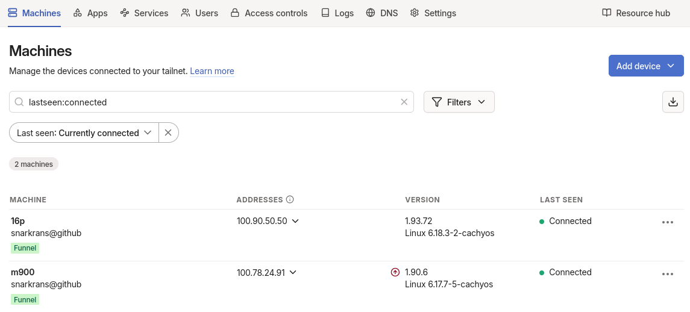

# Home Render Farm for Blender

In this article, I will describe how to set up a home render farm for the 3D editor **Blender**. The core of our farm will be **[Flamenco](https://flamenco.blender.org/)** — an open-source, cross-platform framework for monitoring and managing render jobs.

The framework consists of three components:

- **Flamenco Add-on**
    
- **Flamenco Manager**
    
- **Flamenco Workers**
    

The add-on connects Blender to Flamenco. The Manager distributes jobs between Workers and provides a web interface for controlling the entire process. The Workers are the ones that actually perform the rendering. Flamenco can also be used on a single machine: this won’t increase render speed, but it does improve convenience.

In my opinion, Flamenco is a clearly underrated piece of software that deserves more attention from users. It is quick to deploy, does not require complex infrastructure, and at the same time offers functionality comparable to commercial solutions. For small studios and enthusiasts, it’s an excellent way to organize distributed rendering without extra costs or dependence on third-party services.

To build a full render farm, you will need:

- 2 or more computers;
    
- Blender;
    
- Flamenco;
    
- a shared network directory;
    
- Tailscale — optional, if you don’t want to be limited to a local network.
    

For a minimal setup, a single PC with Blender and Flamenco installed is enough. In this case, one machine will act as both Manager and Worker.

Let’s start with the setup. I will be using **Arch Linux**, however Flamenco also supports **Windows** and **macOS**.

---

## 1. Installing Tailscale

First, we need **Tailscale** — it will allow us to объединить all farm computers into a single virtual network and access the farm from outside the local network.

Tailscale does not require complex VPN configuration, port forwarding, or a dedicated server. After installation, all machines receive a Tailscale IP and can see each other as if they were on the same local network.

Install Tailscale on all farm machines:

sudo pacman -S tailscale
sudo systemctl enable --now tailscaled  
sudo tailscale up`

After running `tailscale up`, a browser will open where you need to authenticate via Google, GitHub, or another supported method.

On a headless server, you can authenticate via SSH using an auth key from the Tailscale admin panel:

`tailscale up --authkey=tskey-KEY`

In my configuration:

- **16p** acts as the Manager;
    
- **m900** acts as a Worker and an NFS server.
    

After that, make sure the machines can ping each other using their Tailscale IPs — these addresses will be required later when configuring NFS and Flamenco.

`ping m900`

---

## 2. Setting up the NFS Share

Any computer can act as the NFS server. In my case, it’s the Worker **m900**.

Install `nfs-utils` and start the service:

`sudo pacman -S nfs-utils sudo systemctl enable --now nfs-server`

Normally this is sufficient, but in my case the filesystem is **ZFS**, so I additionally enable `sharenfs` for the dataset that will host the share and start the corresponding service:

`zfs set sharenfs=on zroot/data/tank sudo systemctl enable --now zfs-share.service`

Create a directory for the share:

`mkdir -p ~/data/tmp/nfs_flamenco`

Important: the path to the shared directory must be **identical on all machines**, otherwise Blender and Flamenco won’t be able to locate files correctly.

Now return to the Manager (**16p**), install the NFS client, and mount the share:

`sudo pacman -S nfs-utils  mkdir -p ~/data/tmp/nfs_flamenco  sudo mount -t nfs m900:$HOME/data/tmp/nfs_flamenco $HOME/data/tmp/nfs_flamenco`

Verify that the share is mounted successfully:

`mount | grep nfs`

---

## 3. Installing Blender and Flamenco

Next, perform the following steps:

- install **[Blender](https://www.blender.org/download/)** and **[Flamenco](https://flamenco.blender.org/download/)** on all machines (installation paths must match). Both are available in the Arch Linux repositories, but I use alpha versions, so I download them from the official websites.
    
- start `flamenco-worker` on **m900** and **16p**. Use the `-manager` parameter to specify the Manager’s Tailscale IP:
    

`flamenco-worker -manager http://100.90.50.50:8080`

- start `flamenco-manager` on **16p**.
    

After starting the Manager, a web browser will automatically open with the initial Flamenco setup wizard. There you will need to specify:

- the path to Blender;
    
- the path to Flamenco;
    
- the path to the shared network directory.
    

After that, the wizard will prompt you to install the Blender add-on. Install it, and your farm is ready to use.

Save your Blender project in the shared directory and submit it for rendering via the **Flamenco Panel** in the _Output Properties_ section.

---

---

